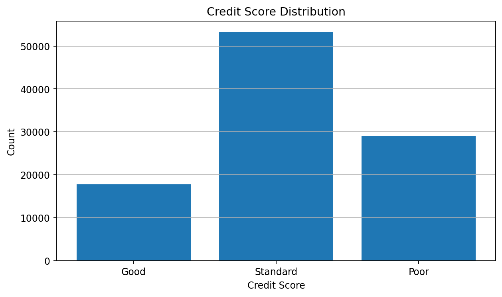
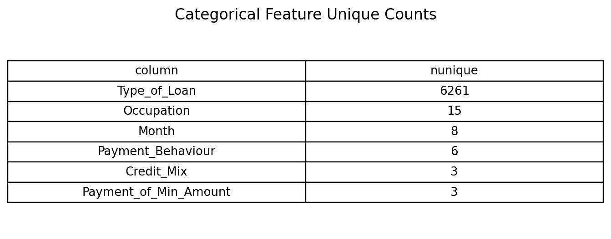
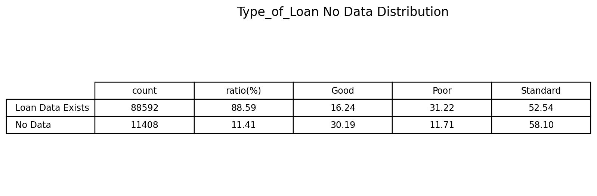
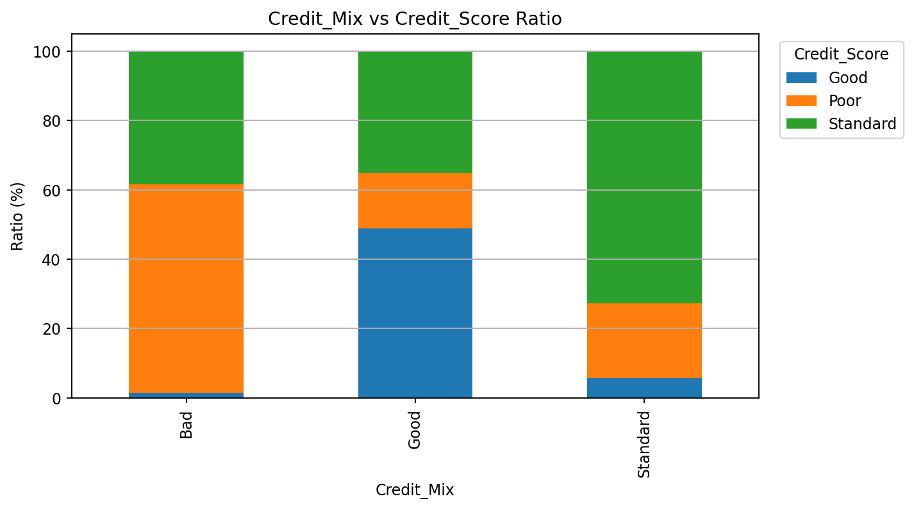

# TabTransformer 기반 신용점수 분류 모델 개선 프로젝트

## 1. 프로젝트 개요

본 프로젝트는 고객의 금융 정보를 기반으로 `Credit_Score`를 `Good`, `Poor`, `Standard` 3개 클래스로 분류하는 딥러닝 기반 다중분류 프로젝트입니다.

초기 모델로는 MLP를 사용하였고, 이후 EDA를 통해 범주형 변수의 복잡성, 문자열형 미기재 값, 클래스 불균형 문제를 확인했습니다. 이를 바탕으로 범주형 변수를 embedding으로 학습할 수 있는 TabTransformer 모델을 적용했습니다.

최종적으로 원본 변수만 사용한 TabTransformer 모델이 가장 높은 validation score를 기록하여 최종 모델로 선정했습니다.

---

## 2. 데이터 설명

사용 데이터는 고객의 소득, 대출, 신용카드, 연체, 신용이력, 결제 행동 등의 정보를 포함합니다.

| 구분 | 변수 예시 |
|---|---|
| 식별자 변수 | ID, Customer_ID, Name, SSN |
| 범주형 변수 | Month, Occupation, Type_of_Loan, Credit_Mix, Payment_of_Min_Amount, Payment_Behaviour |
| 수치형 변수 | Annual_Income, Outstanding_Debt, Interest_Rate, Delay_from_due_date, Credit_History_Age 등 |
| Target | Credit_Score |

식별자 성격이 강한 `ID`, `Customer_ID`, `Name`, `SSN`은 모델 입력에서 제외했습니다.

---

## 3. EDA

### 3.1 Target 분포 확인

`Credit_Score`는 `Standard` 클래스 비중이 가장 높고, `Good` 클래스 비중이 가장 낮았습니다.  
따라서 단순 Accuracy만으로 평가할 경우 다수 클래스 중심으로 성능이 해석될 수 있으므로, Macro F1-score를 함께 확인했습니다.



---

### 3.2 Type_of_Loan 분석

`Type_of_Loan`은 고유값이 6,261개로 매우 많은 복합 범주형 변수였습니다.  
이는 단순 LabelEncoding 방식보다 embedding 기반 범주형 처리가 더 적합하다고 판단한 근거가 되었습니다.



또한 `Type_of_Loan`에는 `No Data` 값이 11,408개 존재했습니다.  
이는 pandas의 `isna()`로는 잡히지 않는 문자열형 미기재 값입니다.



`No Data`는 비중이 작지 않기 때문에 단순 삭제하지 않고, 원본 범주형 값으로 유지했습니다.

---

### 3.3 범주형 변수와 Credit_Score 관계

`Credit_Mix`, `Payment_of_Min_Amount`, `Payment_Behaviour` 등은 `Credit_Score`별 분포 차이가 뚜렷하게 나타났습니다.



따라서 주요 범주형 변수는 제거하지 않고 모델 입력에 포함했습니다.

---

## 4. 전처리

전처리 방향은 다음과 같습니다.

| 처리 항목 | 내용 |
|---|---|
| 식별자 제거 | ID, Customer_ID, Name, SSN 제거 |
| 숨은 결측 처리 | Type_of_Loan의 No Data를 제거하지 않고 원본 범주값으로 유지 |
| 범주형 처리 | train 기준 category mapping 후 embedding 입력 |
| 수치형 처리 | train 기준 StandardScaler fit, validation에는 transform만 적용 |
| Target encoding | Good=0, Poor=1, Standard=2 |
| 클래스 불균형 대응 | alpha=0.5 기반 class weight 적용 |

---

## 5. 모델링 방법

### 5.1 Baseline: MLP

초기 기준 모델로 MLP를 사용했습니다.  
범주형 변수는 LabelEncoding을 통해 수치화한 뒤 수치형 변수와 함께 입력했습니다.

하지만 `Type_of_Loan`처럼 고유값이 많은 범주형 변수는 LabelEncoding으로 처리할 경우 범주 간 순서가 있는 것처럼 모델이 오해할 수 있습니다. 따라서 MLP는 기준 모델로만 사용했습니다.

---

### 5.2 최종 후보: TabTransformer

TabTransformer는 범주형 변수를 embedding으로 변환한 뒤 Transformer Encoder를 통해 범주형 변수 간 관계를 학습할 수 있습니다.

본 데이터는 `Type_of_Loan`, `Credit_Mix`, `Payment_Behaviour` 등 범주형 변수가 중요하게 작용하므로, TabTransformer가 MLP보다 더 적합하다고 판단했습니다.

모델 구조는 다음과 같습니다.

```text
Categorical Embedding
→ Transformer Encoder
→ Numeric Block
→ Concatenate
→ Fully Connected Classifier


데이터 출처: Kaggle - Credit Score Classification Dataset
